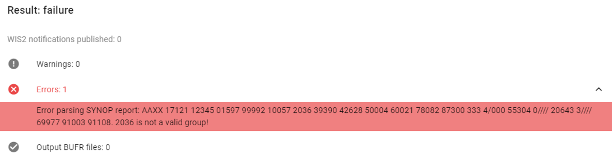

.. _data-ingest:

Ingesting data for publication
==============================

In WIS2, the availability of new data to be downloaded is announced using WIS2 Notifications sent using the MQTT protocol.
Each WIS2 Notification will contain a "canonical" URL to the data to enable the data to be downloaded over HTTP(S).

The *wis2box-management* service listens to updates from the *wis2box-storage*-service about new files received and will attempt to process the files based on the datasets and data mappings that have been configured in the previous section.

The *wis2box-storage* service is based on `MinIO`_ , the following buckets are pre-configured when the wis2box-stack is started for the first time:

- **wis2box-incoming**: this bucket is used to received incoming files and are used as input by the data mappings configured in your wis2box
- **wis2box-public**: this bucket is used to store files to be shared on WIS2, it is proxied by the web-proxy service to make it available over HTTP(S) at `WIS2BOX_URL/data/`

.. note::
 
 If you use "CSV to BUFR" plugin in your data mappings, the columns defined in the input CSV file must match the columns defined by the `csv2bufr-template`. 
 If the columns do not match, the data will not be processed and an error will be raised in the logs of the *wis2box-management* container.
 
 See the :ref:`csv2bufr-plugin` for more information on this data plugin and see the `csv2bufr-templates`_ repository for the template definitions.

To upload data to wis2box and trigger the data ingest process, one of the following methods may be used:

- Use the MinIO Console (recommended to test your setup and understand the data ingest process)
- Use the FM-12 SYNOP form in the wis2box-webapp, to manually trigger FM-12 SYNOP data ingest process
- Use the "Upload file" option in the wis2box-webapp to manually upload and process a file
- Setup an automated workflow to upload data to the `wis2box-incoming` bucket using MinIO client libraries or the MinIO SFTP service

**For production use, it is recommended to setup an automated workflow and to regularly review the data publication workflow in the Grafana-service.**

Data ingest workflow monitoring
--------------------------------

The wis2box-stack includes a `Grafana`_ service to provide pre-configured moniting dashboards, based on metrics collected by  `Prometheus`_ and logs stored by `Loki`_.

To access the Grafana service, visit ``http://<your-host-ip>:3000`` in your web browser.

The Grafana homepage shows an overview with the number of files received, new files produced and WIS2 notifications published.

The `Station data publishing status` panel (on the left side) shows an overview of notifications and failures per configured station.

The `wis2box ERRORs` panel (on the bottom) prints all ERROR messages reported by the wis2box-management container.

.. image:: ../_static/grafana-homepage.png
    :width: 800
    :alt: wis2box workflow monitoring in Grafana

Testing your setup using the MinIO Console
------------------------------------------

To access the MinIO user interface, visit ``http://<your-host-ip>:9001`` in your web browser.

You can login with your ``WIS2BOX_STORAGE_USERNAME`` and ``WIS2BOX_STORAGE_PASSWORD``:

.. image:: ../_static/minio-login-screen2.png
    :width: 400
    :alt: MinIO login screen

.. note::

   The ``WIS2BOX_STORAGE_USERNAME`` and ``WIS2BOX_STORAGE_PASSWORD`` are defined in the ``wis2box.env`` file.

To test the data ingest, add a sample file for your observations in the ``wis2box-incoming`` storage bucket in the path matching your dataset identifier as follows:

- Select 'browse' on the ``wis2box-incoming`` bucket and select 'Choose or create a new path' to define a new folder path. 

Define a new folder path that matches the dataset metadata identifier or the topic in the data mappings, for example:

- Enter the folder path and use "Upload" to upload a file from your local machine in the newly created folder path:

After uploading a file to ``wis2box-incoming`` storage bucket, you can browse the content in the ``wis2box-public`` bucket. 
If the data ingest was successful, data will have been moved to the ``wis2box-public`` bucket, in a folder matching the dataset identifier.

If the no data appears in the ``wis2box-public`` bucket, check for errors and warnings in the dashboard at ``http://<your-host-ip>:3000``.
After addressing the issues, you can re-upload the file to the correct folder in ``wis2box-incoming`` bucket to trigger the data ingest process again.

Once you have verified that the data ingest is working correctly you can prepare an automated workflow to send your data into wis2box.

Uploading data to MinIO using scripts
-------------------------------------

To automate the data ingest process, you can prepare scripts using the MinIO client libraries.
As MinIO is compatible with the S3 API, any S3 client library can be used to upload data to MinIO.

See below a Python example to upload data using the MinIO library for Python:

.. code-block:: python

    import glob
    import sys

    from minio import Minio

    filepath = '/home/wis2box-user/local-data/mydata.bin'
    # path should match the metadata or the topic in the data mappings
    minio_path = 'urn:wmo:md:it-meteoam:surface-weather-observations'

    endpoint = 'http://localhost:9000'
    WIS2BOX_STORAGE_USERNAME = 'wis2box'
    WIS2BOX_STORAGE_PASSWORD = '<your-wis2box-storage-password>'

    client = Minio(
        endpoint=endpoint,
        access_key=WIS2BOX_STORAGE_USERNAME,
        secret_key=WIS2BOX_STORAGE_PASSWORD,
        secure=False)
    
    filename = filepath.split('/')[-1]
    client.fput_object('wis2box-incoming', minio_path+filename, filepath)

.. note::
    
    In the example the file ``mydata.bin`` in ingested from the directory ``/home/wis2box-user/local-data/`` on the host running wis2box.
    If you are running the script on the same host as wis2box, you can use the endpoint ``http://localhost:9000`` as in the example. 
    Otherwise, replace localhost with the IP address of the host running wis2box. 

.. note::

    The MinIO package is required for running the script above.
    
    To install the MinIO package, run the following command:

    .. code-block:: bash

        pip3 install minio
        
Uploading data to MinIO over SFTP
---------------------------------

Data can also be uploaded via MinIO using SFTP.

By default the SFTP service is enabled on port 8022. You can connect to the SFTP service using the MinIO storage username and password.
Using a client such as WinSCP, a user can connect to the SFTP service to visualize the bucket structure in the SFTP client as shown below:

To utilize this functionality, data needs to be uploaded to the ``wis2box-incoming`` bucket, in a directory that matches the dataset metadata identifier or the topic in the data mappings.

For example using the command line from the host running wis2box:

.. code-block:: bash

    sftp -P 8022 -oBatchMode=no -o StrictHostKeyChecking=no wis2box@localhost << EOF
        mkdir wis2box-incoming/urn:wmo:md:it-meteoam:surface-weather-observations.synop
        put /path/to/your/datafile.csv wis2box-incoming/urn:wmo:md:it-meteoam:surface-weather-observations.synop 
    EOF

FM-12 SYNOP form in the wis2box-webapp
--------------------------------------

You can manually ingest FM-12 SYNOP data using the wis2box-webapp.

Select the "FM-12 SYNOP" option from the menu on the left:

.. image:: ../_static/wis2box-webapp-fm12-synop.png
    :width: 1000
    :alt: wis2box webapp FM-12 SYNOP page

Provide the required information in the form:

- Month and year in UTC 
- FM 12 encoded input data
- Dataset identifier
- Authentication token for 'processes/wis2box'

Then click "Submit" to ingest the data. 

If there are issues during the data conversion you click to open the "Warnings" and "Errors" sections to see the details:

If the data conversion is successful you click on "Output BUFR files" to inspect the result:

.. image:: ../_static/wis2box-webapp-synop-form-success.png
    :width: 1000
    :alt: wis2box webapp FM-12 SYNOP page, success example

Manual file upload using the wis2box-webapp
-------------------------------------------

You can also upload files using the wis2box-webapp, to manually trigger the data ingest process.

To access this interface, select the "Upload file" option from the menu on the left:

And follow the instructions to upload a file.

wis2box-data-subscriber
-----------------------

The `wis2box-data-subscriber` provides an example of an additional service on the host running wis2box instance to enable data to be received over MQTT.

.. note::

   This service was developed to work with Campbell Scientific data loggers version CR1000X for selected countries in Africa.

This service subscribes to the topic ``data-incoming/#`` on the wis2box broker and parses the content of received messages and publishes the result in the ``wis2box-incoming`` bucket.

See the GitHub `wis2box-data-subscriber`_ repository for more information on this service.

Next steps
----------

After you have successfully setup your data ingest process into the wis2box, you are ready to share your data with the global
WIS2 network by enabling external access to your public services.

Next: :ref:`public-services-setup`

.. _`MinIO`: https://min.io/docs/minio/container/index.html
.. _`Grafana`: https://grafana.com/docs/grafana/latest/
.. _`Prometheus`: https://prometheus.io/docs/introduction/overview/
.. _`Loki`: https://grafana.com/docs/loki/latest/
.. _`wis2box-data-subscriber`: https://github.com/wmo-im/wis2box-data-subscriber
.. _`csv2bufr-templates`: https://github.com/World-Meteorological-Organization/csv2bufr-templates
