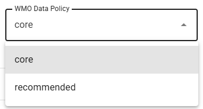
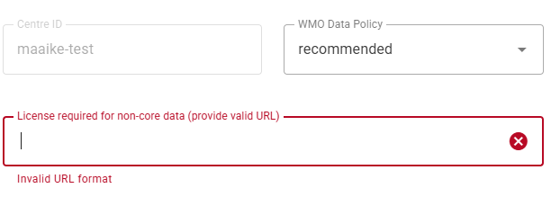
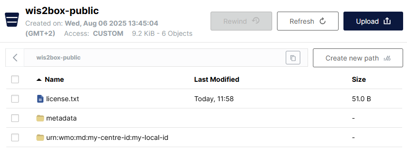
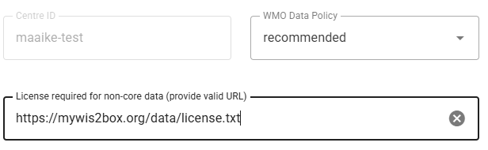

.. _recommended:

Adding a license for recommended datasets
=========================================

Data are shared on WIS2 in accordance with the WMO Unified Data Policy (Resolution 1 (Cg-Ext(2021))). 
This data policy describes two categories of data:

- **core** : data that is provided on a free and unrestricted basis, without charge and with no conditions on use.
- **recommended** : data that may be provided with conditions on use and/or subject to a license.

Data that are shared as **core** are cached by the WIS2 Global Caches and available for download by the general public.

Data that are shared as **recommended**:

- May be subject to conditions on use and reuse;
- May have access controls applied to the data;
- Are not cached within WIS2 by the Global Caches;
- Must have a link to a license specifying the conditions of use of the data included in the discovery metadata.

**Please consult the WMO Unified Data Policy or other WMO publications to help determine the relevant data policy for your datasets.**

When using the wis2box-webapp, select the WMO data policy during the initial dataset creation step:

.. note::
   
   The wis2box-webapp will automatically set the data policy to recommended for datasets using **aviation** in the sub-discipline topic.
   Datasets containing aeronautical meteorological information are considered recommended data for the purposes of publishing through WIS2 to be compliant with ICAO regulations.

When the WMO Data Policy is set to **recommended**, the wis2box-webapp will required a link to the license that applies to the dataset:

A license link can be provided by your organization's website, could be a public license such as one from `Creative Commons`_, or a custom license hosted on your own web server.

If you do not have an existing license link, you can host the license file directly on the wis2box instance. This can be done using the `wis2box-public` bucket, as detailed in the next section.

Using a custom license hosted on wis2box
----------------------------------------

To upload a locally created file ``license.txt``, use the `MinIO Console` available at port `9001` of the wis2box instance, by going to a web browser and visiting ``http://<your-host>:9001``

.. note::

   The MinIO Console is not proxied via wis2box web-proxy; it can only be accessed directly using the IP address or hostname of the wis2box instance,
   on the local network or via a VPN connection.

The credentials to access the MinIO Console in the ``wis2box.env`` file are defined by ``WIS2BOX_STORAGE_USERNAME`` and ``WIS2BOX_STORAGE_PASSWORD`` environment variables.

You can find these in the ``wis2box.env`` file as follows:

.. code-block:: bash

   cat wis2box.env | grep WIS2BOX_STORAGE_USERNAME
   cat wis2box.env | grep WIS2BOX_STORAGE_PASSWORD

Once you have logged in to the MinIO Console, you can upload the license file into basepath of the ``wis2box-public`` bucket using the "Upload" button:

After uploading the license file, check if the file is accessible by visiting ``WIS2BOX_URL/data/<license-file-name>``.

After verifying the URL correctly displays the license uploaded, use this URL in the wis2box-webapp:

Applying access control using wis2box
-------------------------------------

All dataset in wis2box are open by default. The wis2box software provides the option to apply access control to a dataset using an access token.

Access control can be configured using the use the command line available within the wis2box-management container.

To login to the wis2box-management container, run the following command from the wis2box directory:

.. code-block:: bash

   cd ~/wis2box
   python3 wis2box-ctl.py login

To create an randomly generated access token for your dataset, run the following command:

.. code-block:: bash

    wis2box auth add-token --metadata-id urn:wmo:md:my-centre-id:my-local-id

Where ``urn:wmo:md:my-centre-id:my-local-id`` is the metadata identifier of the dataset.

To specify the token yourself, add this an additional argument, for example the add the token `S3CR3TT0K3N`:

.. code-block:: bash

    wis2box auth add-token --metadata-id urn:wmo:md:my-centre-id:my-local-id S3CR3TT0K3N

Token credentials can be validated using the wis2box command line utility.

.. code-block:: bash

    wis2box auth has-access-topic --metadata-id urn:wmo:md:my-centre-id:my-local-id S3CR3TT0K3N

Once a token has been generated, attempting to download data published for that dataset will result in 403 Forbidden if the token is missing or incorrect.

To download access controlled data, tokens need to be passed in the Authentication header. For example to use the token ``S3CR3TT0K3N`` to download data from the WAF using `wget` you would use the following command:

.. code-block:: bash

    wget --header= "Authorization: Bearer mytoken" "https://www.mywis2box.com/data/urn:wmo:md:my-centre-id:my-local-id/mydata.bufr4"

To remove access control from a dataset, use the following command:

.. code-block:: bash

    wis2box auth remove-token --metadata-id urn:wmo:md:my-centre-id:my-local-id

This will remove all tokens for the specified dataset, making it accessible without authentication.

..  _`Creative Commons`: https://creativecommons.org/licenses
