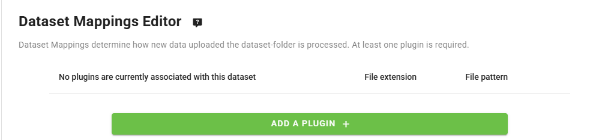

.. _setup-datasets:

Adding datasets and discovery metadata
======================================

Datasets in wis2box are required to define the **discovery metadata** and **data mappings plugins** for data publishing:

- **Discovery metadata**: dataset documentation properties such as title, description, keywords, spatial and temporal extents used to create a WMO Core Metadata Profile (WCMP2) record for the dataset.
- **Data mappings plugins**: define the actions to be performed on the data before it is published, such as transforming the data from the input source format and validating the data content.

For each dataset created, a new WCMP2 record will be created and made available in the HTTP storage of the wis2box instance.

The wis2box-broker will publish a WIS2 data notification for the WCMP2 record at the topic ``origin/a/wis2/CENTRE_ID/metadata``, where ``CENTRE_ID`` is the centre-id of the dataset.

This metadata notification enables the WIS2 Global Discovery Catalogue to download and cache the metadata record, allowing users to discover the dataset when searching the WIS2 Global Discovery Catalogue.

The following sections will explain how to create datasets in wis2box using the wis2box-webapp.

.. note::

   Datasets can also be created by defining MCF (YAML configuration) files in the ``metadata/discovery`` directory in the wis2box host directory and publish them from the CLI.
   For more information on publishing datasets using MCF files, see the Reference guide.

Creating an authentication token
--------------------------------

Before proceeding with the next steps, prepare an authentication token for running processes in the wis2box-webapp.

Login to the wis2box-management container

.. code-block:: bash

   python3 wis2box-ctl.py login

To create a token for running wis2box processes:

.. code-block:: bash

   wis2box auth add-token --path processes/wis2box

Record the token value displayed in a safe place, as it will be required when submitting using the wis2box-webapp.

Accessing the wis2box-webapp
----------------------------

Access the wis2box-webapp by visiting the URL specified during the configuration step in a web browser and adding ``/wis2box-webapp`` to the URL.

For example, if  ``http://mywis2box.example.com`` is specified as the URL, access the wis2box-webapp by visiting ``http://mywis2box.example.com/wis2box-webapp``.

Check the ``WIS2BOX_URL`` environment variable in the ``wis2box.env`` file to find the URL of the wis2box instance:

.. code-block:: bash

   cat wis2box.env | grep WIS2BOX_URL

The wis2box-webapp used basic authentication to control access to the webapp.  The default username is ``wis2box-user`` and the password is the value specified when running the script ``wis2box-create-config.py``.

The values of ``WIS2BOX_WEBAPP_USERNAME`` and ``WIS2BOX_WEBAPP_PASSWORD`` can be found in the ``wis2box.env`` file as follows:

.. code-block:: bash

   cat wis2box.env | grep WIS2BOX_WEBAPP_USERNAME
   cat wis2box.env | grep WIS2BOX_WEBAPP_PASSWORD

.. _adding-datasets:

Creating a new dataset
----------------------

Open the wis2box-webapp in a web browser, provide the ``WIS2BOX_WEBAPP`` credentials, and select the **dataset editor** from the menu on the left, as shown below:

To create a new dataset select "Create new" from the dataset editor page.

A popup will appear where the *"centre-id"* can be defined and the *"Template"* of dataset to be created:

.. image:: ../_static/wis2box-webapp-dataset_editor_continuetoform.png
  :width: 600
  :alt: wis2box webapp dataset editor page, continue to form

.. note::

   The centre-id should start with the ccTLD of your country, followed by a dash (``-``) and an abbreviated name of your organization, for example ``fr-meteofrance``.
   The centre-id must be lowercase and use only alphanumeric characters.
   **To define a new centre-id type the centre-id into the box**, otherwise select one from the dropdown list.
   The dropdown list shows all currently registered centre-ids on WIS2 as well as any new centre-ids for datasets created in the wis2box-instance.

From here, use the option to select a *Template*, such as "weather/surface-based-observations/synop", "weather/surface-based-observations/temp", and "weather/advisories-warnings":

The templates help predefine some of the metadata properties and the data mappings plugins for commonly published data types.

If the dataset does not fit into one of the predefined templates, or to continue without using a template, select "other" from the dropdown list:

Please select "Continue to form" to start defining your dataset.

Defining the metadata identifier of the dataset
-----------------------------------------------

When defining the dataset, specify a **Local ID**, which serves as a short and unique identifier for the dataset. The Local ID is used to generate the identifier for the WCMP2 metadata record:

**The local ID is used to generate the metadata identifier for the dataset**. The identifier for the dataset is defined as ``urn:wmo:md:<centre-id>:<local-id>``, where ``<centre-id>`` is the centre-id defined earlier and ``<local-id>`` is the local identifier defined.

.. note::

   If a local identifier is not provided, a randomly generated identifier will be assigned. It is strongly suggested to define a human-readable identifier. Once the dataset is created, the Local identifier cannot be changed. To use a different local identifier, you will need to delete and recreate the dataset.

Defining the topic hierarchy
----------------------------

If a template was selected, the topic hierarchy will be pre-populated with the default topic hierarchy defined in the template, 
for example for the "weather/surface-based-observations/synop" template:

If "other" was selected as the template, the option exists to select the "Discipline topic" and "Sub-discipline topics", 
which will be used to define the topic hierarchy for the dataset:

The WMO Data Policy can be selected for the dataset.  If "recommended" is selected, the wis2box-webapp will require a link to a license that applies to the dataset.

.. note::

   For more information on publishing recommended datasets, see the :ref:`recommended`.

If "other" is was used as the template, the user will have the option to select "Publish metadata without WIS2 data notifications". This option can be used to only publish metadata (and no data).

In this case, no WIS2 Topic Hierarchy is defined, a data download link will be required.

Validating the form
--------------------

Provide all other fields requested in the form: add a relevant description for your dataset, review and add keywords and choose an appropriate bounding box.

You will also need to provide some contact information for the dataset.

Before publishing the new dataset, click "Validate form" to check if all required fields are completed:

.. image:: ../_static/wis2box-webapp-dataset_editor_validateform.png
  :width: 1000
  :alt: wis2box webapp dataset editor page, validate form

Defining the data mappings plugins
----------------------------------

Each dataset is associated with data-mappings plugins that transform the data from the input source format before the data is published.

If you selected a template, the data mappings plugins will be pre-populated with the default plugins defined in the template.

For example, if the "weather/surface-based-observations/synop" template is selected, the data mappings plugins will be pre-populated with the following plugins:

.. note::

   If  "core" is selected as a data policy, data will be cached by the WIS2 Global Cache by default. Uncheck the box below the "Data Mappings" section if you wish for data NOT to be cached by the WIS2 Global Cache.
   
   In this case, users will directly download core data from your HTTP storage endpoint, which must be able to handle the expected data traffic and be accessible to any incoming connections.

If "other" is selected as the template, add at least one data mappings plugin to the dataset by clicking the "Add a plugin" button:

To publish data without any transformation or data validation, select the "Universal" plugin:

Verify that the "File Extension" and "File Pattern" are set to match the data files that will be uploaded to the `wis2box-incoming` bucket in MinIO storage.

Note that the "File Pattern" may be used to extract additional metadata from the file name, such as the datetime for the published data.

.. note::

   See the :ref:`extending-wis2box` section for more information on available data mappings plugins and how to create custom plugins.

Publishing the dataset
----------------------

When the dataset is published, the wis2box-webapp will create a WCMP2 record and publish it to the topic ``origin/a/wis2/CENTRE_ID/metadata``, where ``CENTRE_ID`` is the centre-id of the dataset.

.. note::

   To verify the metadata publication use an MQTT client subscribed to your wis2box-broker before clicking "SUBMIT".

Provide the authentication token created earlier in the "Authentication Token" field and click "SUBMIT" to publish the dataset:

.. image:: ../_static/wis2box-webapp-dataset_editor_success.png
  :width: 800
  :alt: wis2box webapp dataset editor page, submit

A success message will display, indicating that the dataset has been created successfully.

Next steps
----------

If the dataset is using any of the following plugins in the data mappings, station metadata will be required before publishing data:

- BUFR data converted to BUFR
- FM-12 data converted to BUFR
- CSV data converted to BUFR

See :ref:`setup-stations` on how to add station metadata in wis2box.

Otherwise, start publishing data to the dataset by uploading files to the ``wis2box-incoming`` bucket in MinIO storage as described in the :ref:`data-ingest` section of the User guide.

.. _`WIS2 topic hierarchy`: https://github.com/World-Meteorological-Organization/wis2-topic-hierarchy
