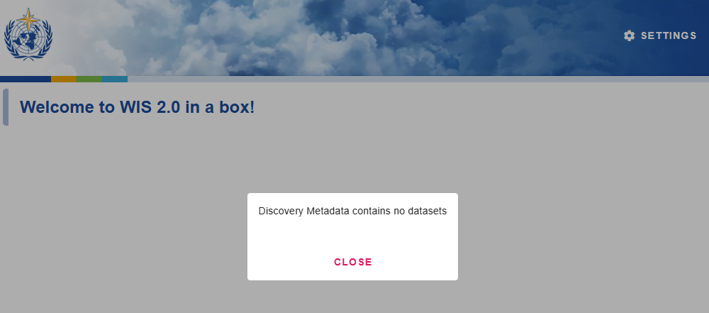

.. _setup:

Installation and configuration
==============================

This section summarizes the steps required to install a wis2box instance and setup datasets using the initial configuration files
provided by using the ``wis2box-create-config.py`` script.

Ensure that Docker, Docker Compose and Python are installed on the host, and that the system and :ref:`network requirements<getting-started>` are met.

Download
--------

Download `wis2box-setup.zip` from the `wis2box Releases`_ page and unzip using the following commands:

.. code-block:: bash

   wget https://github.com/World-Meteorological-Organization/wis2box-release/releases/download/1.1.0/wis2box-setup.zip
   unzip wis2box-setup.zip
   cd wis2box

Create initial configuration files
----------------------------------

Run the following command to create the initial configuration files for your wis2box:

.. code-block:: bash

   python3 wis2box-create-config.py

.. note::

    The ``wis2box-create-config.py`` script will ask for a directory to store the configuration files.
    Please provide the **absolute** path to the directory where you want to store the configuration files, for example ``/home/wis2box-user/wis2box-data``.
    This directory will be mapped to ``/data/wis2box`` **inside** the wis2box-management container.

   The script will also ask for the URL of your wis2box. Please provide the public URL of your wis2box, for example ``http://mywis2box.example.com``.
   For testing purpose you can also provide the internal IP address you use to access the host, for example ``http://192.168.0.3`` and you change the URL in configuration files at a later point in time.

   The script will propose to automatically create a password for ``WIS2BOX_WEBAPP_PASSWORD``. This password is used to access the wis2box-webapp interface.

   The script will also propose to automatically create passwords for ``WIS2BOX_STORAGE_PASSWORD`` and ``WIS2BOX_BROKER_PASSWORD``.
   These passwords are for internal use only within the wis2box, and it is recommended to accept the randomly generated passwords.

The script will have created a file ``wis2box.env`` with the configuration settings required to start your wis2box.

.. note::

   You can edit the environment variables ``WIS2BOX_BASEMAP_URL`` and ``WIS2BOX_BASEMAP_ATTRIBUTION``
   in ``wis2box.env`` to customize the base-map URL and attribution that will be used in the wis2box frontends.

Starting wis2box
----------------

Once you have prepared the necessary configuration files as described above you are ready to start the wis2box.

Run the following command to start wis2box:

.. code-block:: bash

   python3 wis2box-ctl.py start

When running this command for the first time, you will see the following output:

.. code-block:: bash

   No docker-compose.images-*.yml files found, creating one
   Current version=Undefined, latest version=1.1.0
   Would you like to update ? (y/n/exit)

Select ``y`` and the the script will create the file ``docker-compose.images-1.1.0.yml`` file, download the required Docker images and start the services.

Downloading the images may take some time depending on your internet connection speed. This step is only required the first time you start wis2box.

.. note::

   The ``wis2box-ctl.py`` program is used as a convenience utility around a set of Docker Compose commands.
   You can customize the ports exposed on your host by editing ``docker-compose.override.yml``.

.. note::

   In case you get errors from the Docker daemon stating 'Permission denied', such as:

   ``docker.errors.DockerException: Error while fetching server API version: ('Connection aborted.', PermissionError(13, 'Permission denied'))``

   Please ensure your username is added to the Docker group using the command:

   ``sudo usermod -aG docker <your-username>``.

   Logout and log back in so that your group membership is re-evaluated.

Once the command above is completed, check that all services are running (and healthy).

.. code-block:: bash

   python3 wis2box-ctl.py status

Check that all services are Up and not unhealthy:

.. code-block:: bash

            Name                       Command                  State                           Ports
   -----------------------------------------------------------------------------------------------------------------------
   elasticsearch            /bin/tini -- /usr/local/bi ...   Up (healthy)   9200/tcp, 9300/tcp
   grafana                  /run.sh                          Up             0.0.0.0:3000->3000/tcp
   loki                     /usr/bin/loki -config.file ...   Up             3100/tcp
   mosquitto                /docker-entrypoint.sh /usr ...   Up             0.0.0.0:1883->1883/tcp, 0.0.0.0:8884->8884/tcp
   mqtt_metrics_collector   python3 -u mqtt_metrics_co ...   Up             8000/tcp, 0.0.0.0:8001->8001/tcp
   nginx                    /docker-entrypoint.sh ngin ...   Up             0.0.0.0:80->80/tcp
   prometheus               /bin/prometheus --config.f ...   Up             9090/tcp
   wis2box                  /entrypoint.sh wis2box pub ...   Up
   wis2box-api              /app/docker/es-entrypoint.sh     Up
   wis2box-auth             /entrypoint.sh                   Up
   wis2box-minio            /usr/bin/docker-entrypoint ...   Up (healthy)   0.0.0.0:9000->9000/tcp, 0.0.0.0:9001->9001/tcp
   wis2box-ui               /docker-entrypoint.sh ngin ...   Up             0.0.0.0:9999->80/tcp
   wis2box-webapp           sh /wis2box-webapp/ ...          Up (healthy)   4173/tcp

Refer to the :ref:`troubleshooting` section if this is not the case.

Check HTTP interfaces on web-proxy
----------------------------------

wis2box includes the *web-proxy*-service, which is a web proxy based on `nginx`_.  It is configured to listen on port ``80`` and port ``443`` on the host, and it proxies requests to the various services in wis2box.

To verify that the web-proxy is running and accepting connections, check the following URLs in a web browser:

Check the wis2box API is available at ``WIS2BOX_URL/oapi``:

Check the wis2box user interface is available at ``WIS2BOX_URL/`` (note that no datasets are configured yet):

Check the proxy to the "wis2box-public" bucket from the storage service is available at ``WIS2BOX_URL/data/``
(make sure to add a trailing slash after ``data``):

Check MQTT connection
----------------------

wis2box includes the *wis2box-broker* service, which is a MQTT broker based on `mosquitto`_.

Check that the wis2box-broker is running and accepting connections using `MQTT Explorer`_ or by using a command line tool such as `mosquitto_sub`.

Two sets of MQTT users are automatically pre-configured when first starting wis2box:

**everyone**

- This user is used for public access to the MQTT broker and has readonly access on the ``origin/a/wis2/#`` topic. 
- This user can be used to allow the WIS2 Global Broker to subscribe to the wis2box.
- ``username=everyone``, ``password=everyone``

**wis2box**

- This user is used by wis2box services to publish data to the MQTT broker and has read/write access to ``origin/a/wis2/#`` topic.
- ``username=wis2box``, ``password=WIS2BOX_BROKER_PASSWORD`` (as defined in ``wis2box.env``).

The wis2box MQTT broker is available on port ``1883`` on the host.

The web-proxy also enables access to the MQTT broker via WebSockets on port ``80`` on the path ``/mqtt``.

See the section :ref:`public-services-setup` for information on adding SSL encryption to the MQTT broker.

Next steps
----------

The next step is to :ref:`configure datasets<setup-datasets>`.

.. _`MQTT Explorer`: https://mqtt-explorer.com
.. _`wis2box releases`: https://github.com/World-Meteorological-Organization/wis2box-release/releases
.. _`nginx`: https://www.nginx.com
.. _`mosquitto`: https://mosquitto.org
